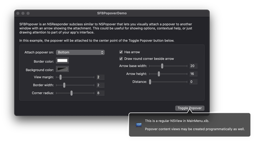

# SFBPopovers

SFBPopovers is a framework implementing customizable popover windows.

## Inspiration

Although the majority of the code was written by me the inspiration came from two similar products:

1. [MAAttachedWindow][1] by Matt Gemmell
2. [INPopoverController][2] by Indragie Karunaratne

Each has its strong points, but in the end I decided to combine the best features of both into my own framework.

  [1]: http://mattgemmell.com/2007/10/03/maattachedwindow-nswindow-subclass
  [2]: https://github.com/indragiek/INPopoverController

## License

Released under the [MIT License](https://github.com/sbooth/SFBPopovers/blob/main/LICENSE.txt).
